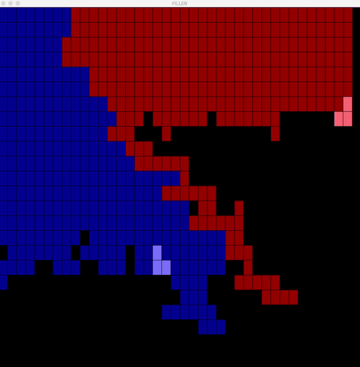

# filler
VM and player algorithm for competition. Each player tries to fill most space using tetrominoes.

42 graph tracing/pathfinding project with graphical interface.



## Table of contents

- [Subject](#subject)
- [Usage](#usage)

# Subject

Filler is a game, where two players / algorithm are fighting on a map.

A virtual machine organizes the game :

calls the players alternatively
give each a random piece
On each turn, the current player have to put his piece on the map, and try to bother the ennemy. To put a piece, the player have to write its coordinates in the "Y X\n" format on the standard input (stdin).

The game appears on the standard input.

The aim of the game is to put more pieces on the map than the enemy.

# Usage

```console
make cmain
```
or
```console
make
cp hasmith.filler resources/players
./resources/filler_vm -f resources/maps/map00 -p1 resources/players/hasmith.filler -p2 resources/players/abanlin.filler
```
